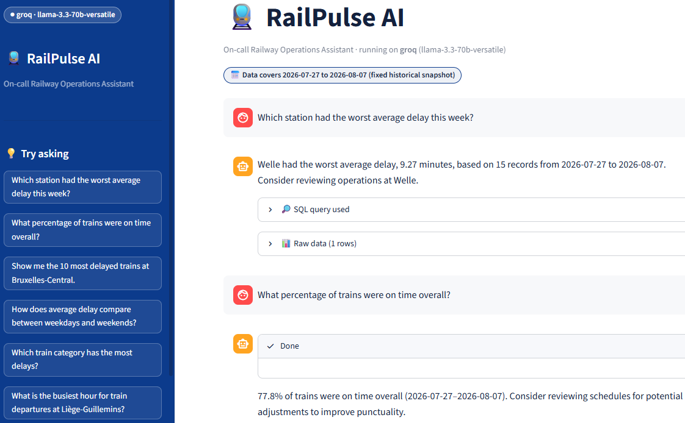
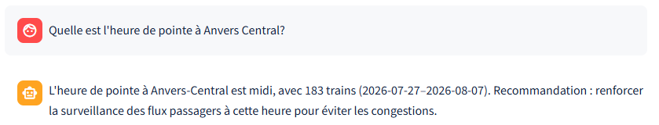
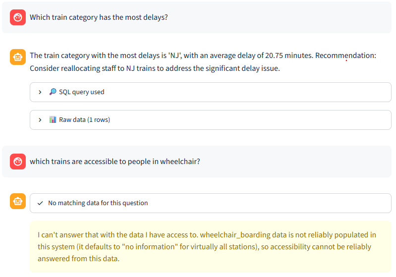
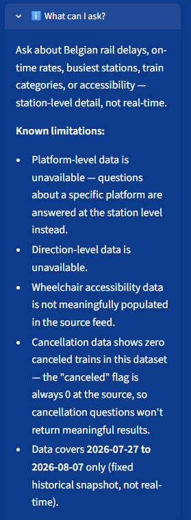

# 🚆 RailPulse AI: Intelligent Transit Insights

I built RailPulse AI, a chat assistant that turns natural-language questions about Belgian rail operations (delays, traffic volume, train categories, etc.) into SQL-backed answers with a short, tactical recommendation attached. It runs entirely on free, open-source LLMs, using data exported from my RailPulse Power BI dashboard (Sprint 3), itself fed by my Azure ingestion pipeline (Sprint 2).

- **Data covers:** 2026-07-27 to 2026-08-07 (fixed historical snapshot, not real-time)
- **Overall on-time rate:** 77.8%
- **Stack:** Python, SQLite, Streamlit, LLM (Groq free tier / Ollama)



## 📑 Table of Contents

- [Quick Start](#quick-start-windows)
- [Features](#features)
- [Setup](#setup)
- [Quick Validation](#quick-validation)
- [Project Structure](#project-structure)
- [Data Schema](#data-schema)
- [Example Queries](#example-queries)
- [Weekly Reports](#weekly-reports)
- [Known Limitations](#known-limitations)
- [Key Challenges](#key-challenges)
- [Nice-to-Have Features](#nice-to-have-features)
- [Deliverables](#deliverables)
- [Conclusion](#conclusion)
- [Author](#author)

## 🚀 Quick Start (Windows)

The database is already included in this repo (`data/railpulse_ai.db`). Configure the provider
(Groq or Ollama — both covered in [Setup §3](#setup)), then:

```
.venv\Scripts\Activate.ps1
python -m streamlit run app\streamlit_app.py --server.address=127.0.0.1
```

A sample weekly report is already included in `reports/`. I generate it with:
```
python scripts\generate_weekly_report.py
```

## ✨ Features

- **Text-to-SQL**: I translate natural language questions into SQL and execute them against the database.
- **RailPulse Consultant**: reframes results as a short, tactical operational recommendation, not a raw data dump.
- **Weekly operations report**: a standalone script runs a fixed set of aggregate queries and generates an
  executive summary alongside a fully deterministic per-station table (see [Weekly Reports](#weekly-reports)).
- **Safety guardrails**: only `SELECT` statements are allowed, destructive keywords are blocked,
  the DB connection itself is opened in true read-only mode (URI: `?mode=ro`), and every column referenced must
  exist in a whitelist so a hallucinated column name fails loudly instead of returning garbage.
- **Deterministic anti-hallucination guards**: Python-level validators/correctors catch failure modes
  a weak free-tier model doesn't reliably avoid on its own — wrong sort direction, tautological
  percentages, invented entities, fabricated causes, ungrounded time claims (see [Key Challenges](#key-challenges)).
- **Automatic unit conversion**: delays are stored in seconds; I convert to minutes for all human-facing output.
- **Provider-agnostic LLM client**: I can switch between Ollama (local) and Groq (hosted) with a single environment variable — no code changes.
- **Live data-range badge**: I query the exact date coverage straight from the database and show it at the top of the app, so it can never drift out of sync with what's actually loaded.

Multilingual questions work out of the box, since the underlying model handles the translation:



## ⚙️ Setup

### 1. Install dependencies

```
python -m venv .venv
.venv\Scripts\Activate.ps1
pip install -r requirements.txt
```

### 2. Database

`data/railpulse_ai.db` ships pre-built in this repo (~42 MB), so no build step is required to run the app.
The raw CSV exports it was built from are **not** included. Only someone with a fresh Power BI export needs to rebuild the database, by placing the 5 source CSVs in `data/` and running:

```
python scripts\build_database.py
```

I noticed the raw export contained heavy duplication in `liveboard_records`, from continuous
GTFS-Realtime polling capturing the same still-upcoming train on every cycle. The build script
deduplicates on `(vehicle_id, Scheduled Date, station_id)`, keeping the most recently polled
record per real train stop — see [Key Challenges](#key-challenges) for the full story of why
`station_id` has to be part of that key. It also normalizes `trips.trip_id` (trailing `:1`, `:2`...
variant suffixes stripped into `trip_base_id`) so it joins safely 1:1 against
`liveboard_records.vehicle_id`.

### 3. Configure the LLM provider

Create a `.env` file in the project root and choose a provider:

**Option A — Groq (recommended, free-tier hosted API)**
```
LLM_PROVIDER=groq
GROQ_API_KEY=your_key_here
GROQ_MODEL=llama-3.3-70b-versatile
```

**Option B — Ollama (fully local, no API key, slower without a GPU)**
```
ollama pull llama3.2:3b
```
```
LLM_PROVIDER=ollama
OLLAMA_MODEL=llama3.2:3b
```

### 4. Run the app

```
python -m streamlit run app/streamlit_app.py --server.address=127.0.0.1
```

## ✅ Quick Validation

Once [Setup](#setup) is done, confirm everything works end-to-end:

```
python test_pipeline.py
```
Real smoke test (8 questions through the full pipeline) — uses LLM quota.

## 🗂️ Project Structure

```
railpulse-genai/
├── app/
│   ├── __init__.py
│   ├── config.py             # provider + DB configuration
│   ├── db.py                  # SQLite connection + safe execution
│   ├── guardrails.py          # SQL safety validation
│   ├── llm_client.py          # provider-agnostic call_llm() + validators/correctors
│   ├── prompts.py              # Text-to-SQL + Consultant + weekly report prompts
│   ├── sql_utils.py            # SQL extraction helpers
│   └── streamlit_app.py        # chat UI
├── data/
│   └── railpulse_ai.db         # pre-built, included, raw CSV exports are gitignored
├── images/                    
├── reports/                    # weekly executive briefs (generated)
│   └── weekly_report_<date>.md
├── scripts/
│   ├── build_database.py
│   ├── check_values.py         # schema/data sanity-check queries
│   └── generate_weekly_report.py
├── .env
├── .gitignore
├── README.md
├── requirements.txt
└── test_pipeline.py            # CLI smoke-test harness
```

## 🗃️ Data Schema

5 tables loaded into SQLite from the Power BI export:

**`liveboard_records`** — main table, one row per real train **stop** event, deduplicated on
`vehicle_id` + `Scheduled Date` + `station_id`. Already denormalized with station and vehicle
info joined in, so most questions don't require any JOIN.
`record_id`, `station_id`, `vehicle_id`, `platform`, `scheduled_time`, `delay_seconds`,
`canceled`, `pulled_at`, `Stations Name`, `stations.wheelchair_boarding`,
`vehicles.vehicle_type`, `vehicles.direction`, `Hour`, `day_of_week`, `Delay Severity`,
`Scheduled Date`

**Reference tables** (joined in only when a question needs them):
- **`stations`** — station names, coordinates, wheelchair/location metadata
- **`routes`** — GTFS route info, incl. `train_category` (IC/S/L/etc.)
- **`trips`** — `trip_id` + normalized `trip_base_id` for safe 1:1 joins to `vehicle_id`
- **`vehicles`** — vehicle type and direction

## 💬 Example Queries

Comparisons get a grounded recommendation; questions touching unavailable data (see
[Known Limitations](#known-limitations)) get a clean decline instead of a guess:



## 📄 Weekly Reports

`scripts/generate_weekly_report.py` runs a fixed set of aggregate queries (on-time rate, delay
severity breakdown, best/worst/busiest stations, cancellations, delay by day of week and by
train category), then asks the LLM for a short executive-summary narrative grounded strictly in
those numbers — validated and auto-corrected with the same guard functions used in the chat.

The per-station detail table underneath is **not** generated by the LLM at all: it's rendered
straight from SQL, so it carries zero hallucination risk. Stations with fewer than 10 records in
the period are excluded as statistically unreliable. Output goes to
`reports/weekly_report_<YYYYMMDD>.md`; a sample is already committed in `reports/`.

## ⚠️ Known Limitations

I clearly specify what the assistant can't answer reliably, both in its sidebar and in its
actual behavior — it declines gracefully instead of guessing:



- Platform-level and direction-level data are unavailable (empty at ingestion) — answered at the
  station level instead.
- Wheelchair accessibility is unpopulated for virtually all stations — enforced as a hard `NO_QUERY`
  at the code level, not just in the prompt.
- Cancellation data shows zero canceled trains across the whole period — the `canceled` flag is
  always 0 at the source.
- Ingested data is a sample of liveboard polling calls, not exhaustive real-time traffic — absolute
  volumes (e.g. "trains per hour") may read lower than actual throughput.
- Day-of-week averages rest on a thin sample: ~12 days of data means each weekday appears only
  1-2 times, so one outlier train can shift a whole day's average.
- No root-cause column exists in the schema (no dwell-time, signalling, or weather data) — the
  assistant can report a delay number, never explain its cause.

## 🧠 Key Challenges

- **Deduplication needed a second key I initially missed.** The GTFS-Realtime poller re-captures
  the same still-upcoming train every polling cycle, so a naive "remove duplicate `record_id`"
  check catches nothing — each duplicate gets its own new ID. My first fix, dedup on `(vehicle_id, 
  Scheduled Date)`, correctly turned 980K raw rows into ~12.6K — but `vehicle_id` identifies a whole train journey, not a single stop, so it silently collapsed every multi-stop train down to just one station. 
  Adding `station_id` to the key fixed it: every legitimate stop now survives, only true re-polls of the same stop collapse, expanding the database to its real final size of 99,014 rows.
- **A weak free-tier model doesn't always follow its own instructions.** Prompt-level rules alone
  weren't enough — the model would still occasionally query a forbidden column, pick the wrong
  sort direction, or pad a recommendation with an invented cause the SQL never looked at. I built
  a library of deterministic Python validators that inspect the SQL and final answer directly,
  with a retry loop first and a hard rewrite/strip as a last resort.
- **Free versions of LLM APIs enforce very strict rate limits.** Groq limits request spikes,
  which are systematically triggered by running a full suite of basic tests (8 questions × up to
  2 calls each). I resolved this issue by implementing automatic retries for 429 errors (using the
  retry logic built into Groq's official SDK) and spacing out requests in the test harness — and
  I reduced the smoke test suite itself from 18 to 8 questions to stay well below the daily quota
  for the free plan.

## ✅ Deliverables

- [x] GitHub repository with the full application source code
- [x] Documented local setup guide (see [Setup](#setup))
- [x] Prompt engineering file (`app/prompts.py`) with structured few-shot guidelines for open-source models

## 🌟 Nice-to-Have Features

All 3 optional stretch goals from the assignment brief are implemented:

- [x] **Strict Query Validation (Safety Layer)** — `guardrails.py` blocks `DROP`, `DELETE`, `UPDATE`,
  `INSERT`, `ALTER`, and other destructive keywords before any generated SQL reaches the database.
  I went a layer further than the brief asked: the SQLite connection itself is opened in true
  read-only mode (`?mode=ro` in `db.py`), so even a query that somehow slipped past the regex
  still can't write to disk.
- [x] **Dynamic Few-Shot Prompting** — `prompts.py` pairs sample questions with exact, schema-correct
  SQL for this dataset's specific quirks (the `trip_base_id` join, minimum-sample-size guards — 10 for
  stations, 5 for train categories — the CASE/GROUP BY tautology trap), so a small open-source model
  has a concrete pattern to match instead of guessing at the schema from scratch.
- [x] **Automated Weekly Report Generator** — `scripts/generate_weekly_report.py` pulls the top delay
  anomalies (worst/best stations, severity breakdown, day-of-week and train-category trends) and asks
  the LLM to write a short executive summary in Markdown, validated against the same anti-hallucination
  guards used in the chat. The per-station detail table underneath is rendered straight from SQL, not
  the LLM, so it carries zero hallucination risk.

## 🏁 Conclusion

This project took me from a single Power BI export to a working, provider-agnostic chat assistant that someone with no SQL knowledge could safely use. The biggest lesson wasn't really about text-to-SQL prompting — it was learning not to fully trust a free, lightweight model to follow instructions every single time, and building a second, deterministic safety net (validators/correctors)in code instead. And I don't know if the paid plan is better, but I guess it is. There's always room for improvement, but this is where my RailPulse adventure ends, for now.

## 👩‍💻 Author

Siegried Camus — BeCode AI & Data Science bootcamp